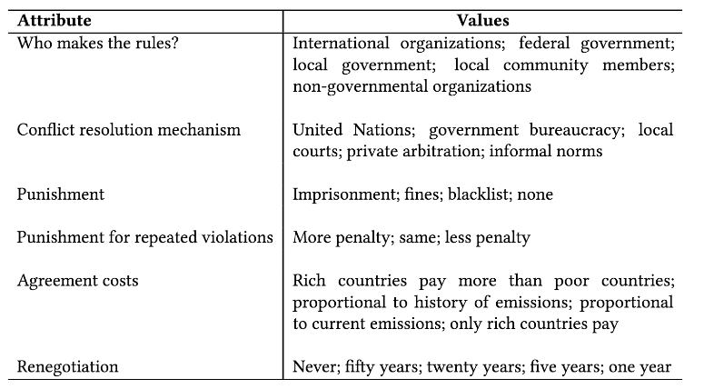

```{r,setup, include=FALSE}
knitr::opts_chunk$set(cache=TRUE)
```

## Introduction

\large

* International climate summits have fallen short of expectations

* Debates about which institutional features lead to successful agreements

* Climate agreements are incomplete contracts:
	- Take domestic circumstances into account
	- Voluntary goals (e.g., Nationally Determined Contributions)
	- More accountability, but higher transaction costs

* Increases the importance of local elites

## Introduction

* Elites act as _de facto_ veto players in local environmental policies

* Behavior of elite groups -- advocacy groups, lobbyists, political coalitions -- explains countries' climate policy performance (Jahn 2016; Karapin 2012)

* "Societal steering" (Andonova et al. 2009; Bulkeley et al 2014): capacity building and rule-setting

## Puzzle

* Recent studies on public opinion and climate agreements (Aklin et al 2013; Bechtel and Scheve 2013; Mildenberger and Tingley 2017)

* Elite preferences not documented in the literature

* Elite coalitions are important in international trade and finance

* _What climate agreement are elites willing to support?_

## Data and Methods

* Conjoint experiments to estimate the effect of institutional features on climate agreements

* Elites in Argentina, Bolivia, Brazil, Chile, Colombia, Costa Rica, Ecuador, Mexico, Panama, and Peru:
	- 101 members of the executive
	- 61 members of the legislative
	- 194 academics in the energy sector
	- 226 Members civil society

* Each respondent evaluated 7 pairs of conjoint experiments

## Data and Methods



## Example


## Results


## Who Makes the Rules?


* Elites favor international organizations and local governments; distrust NGOs

* Results support long Latin American tradition of reliance on the state

## How Are Conflicts Resolved?


* Similar pattern: respondents prefer the UN and local courts

* Informal norms are the least preferred option

## What Punishment Do They Use?


## Limitations

## Conclusion

## Let's Keep in Touch

\Large
**Danilo Freire**

\normalsize
Postdoctoral Research Associate, The Political Theory Project, Brown University

<danilofreire@brown.edu>

<http://danilofreire.github.io>

<http://twitter.com/danilofreire>
