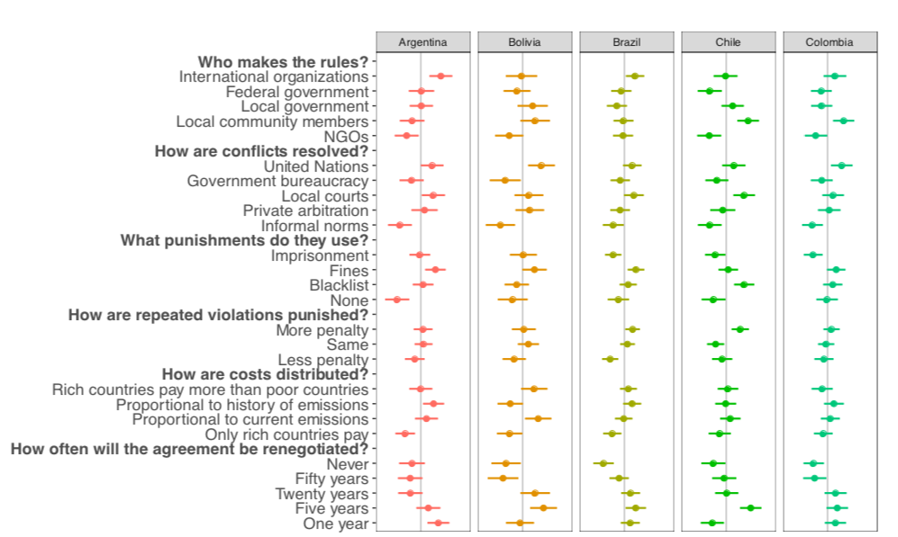
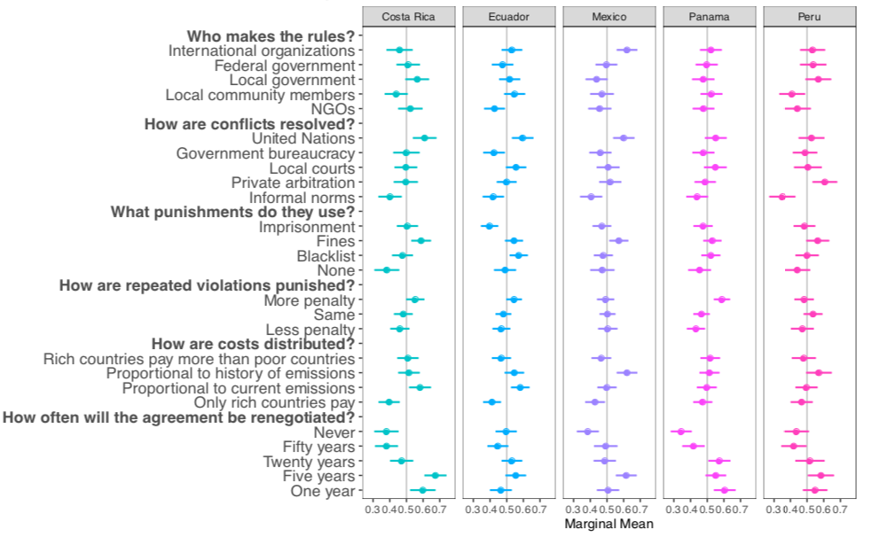
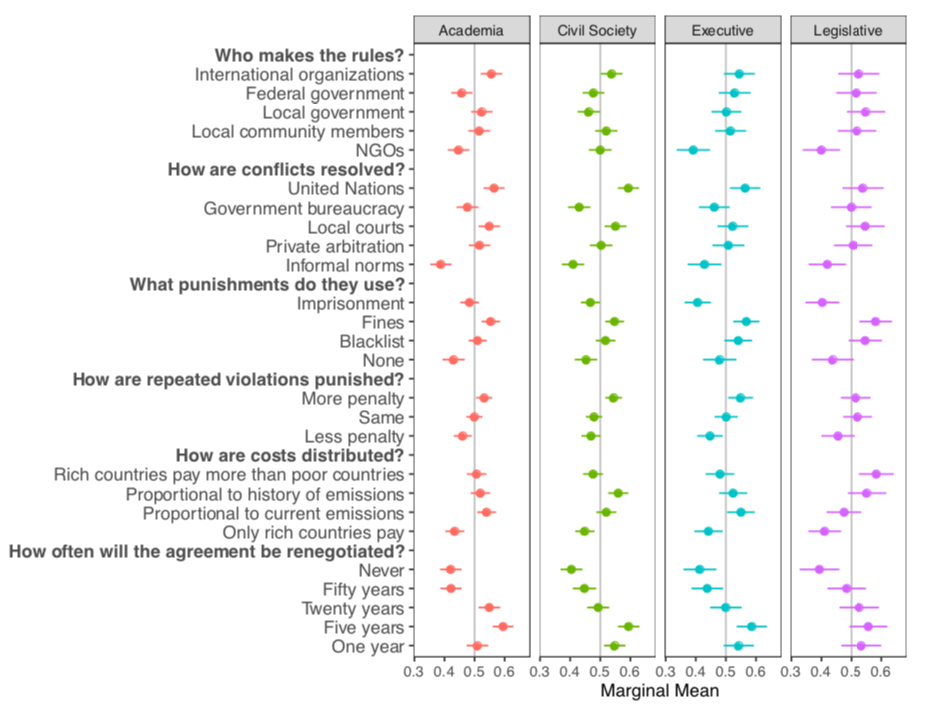

```{r,setup, include=FALSE}
knitr::opts_chunk$set(cache=TRUE)
```

## Background

\large

* Climate change policies require popular support

* Multi-level governance and incomplete contracts: 
	- Flexible provisions
	- Take domestic circumstances into account
	- Voluntary goals (e.g., Nationally Determined Contributions)

* Benefits of civil society engagement:
	- Avoids gridlocks by reducing contracting costs to states (Keohane and Victor 2011)
	- Reduces unnecessary punishment and increase commitment (Mildenberger and Tingley 2017) 
	- Local knowledge/effective monitoring (Ostrom 1990, 2004)

## Literature Review

* More accountability, but higher transaction costs

* Debates about which type of institution fosters cooperation

* Research on public opinion and support for climate policies (Aklin et al. 2013; Bechtel and Schieve 2013; Bechtel et al. 2017)

* Public is very sensitive to institutional design features 
	- Norms of reciprocity
	- Economic costs 
	- Agreement enforcement

## Gaps in the Literature 

* Developing countries underrepresented although they account for 63% of global emissions

* Focuses on public at large, not those with high stakes in climate negotiations: *elites* 

* Behaviour of local elites -- advocacy groups, lobbyists, political coalitions -- largely explains countries' climate policy performance (Jahn 2016; Karapin 2012)

* "Societal steering" (Andonova et al. 2009; Bulkeley et al. 2014)
	- Capacity building
	- Information-sharing 
	- Rule-setting

* Elites are _de facto_ veto players in local environmental policies

## Research Question

* _What climate agreement are Latin American elites willing to support?_

* Most biodiverse region of the world (Benitez and Obersteiner 2006; Yang et al. 2018)

* Central America has four countries in the top ten most affected by extreme weather events (Eckstein et al. 2017)

* State capture by elites (Guasch et al. 2003)

## Data and Methods

* Conjoint experiment to estimate the effect of institutional features on hypothetical climate agreements

* 654 elites members in Argentina, Bolivia, Brazil, Chile, Colombia, Costa Rica, Ecuador, Mexico, Panama, and Peru:
	- 101 members of executive
	- 61 legislators
	- 194 academics in the energy sector
	- 226 members of civil society

* Each respondent evaluated 7 pairs of conjoint experiments 

## Data and Methods

* We vary the agreements across six dimensions:

	- rule-making capabilities (Dubash et al. 2013; Massey et al. 2014)
	- conflict resolution mechanisms (Huntjens et al. 2012; Ostrom 2014)
	- enforcement methods (Barrett 2008)
	- punishment for repeated violators (Ostrom 1990);
	- cost sharing (Bechtel and Scheve 2013)
	- agreement duration (Copelovitch and Putnam 2014; Marcoux 2009). 

## Data and Methods


## Example


## Results


## Who Makes the Rules?


* Elites favour international organizations and local governments; distrust NGOs

* Results support long Latin American tradition of reliance on the state

## How Are Conflicts Resolved?


* Similar pattern: respondents prefer the UN and local courts

* Informal norms are the least preferred option

## What Punishment Do They Use?


## How Are Repeated Violators Punished?


* Graduated sanctions (Ostrom 1990)

## How Are Costs Distributed?


* No evidence respondents intend to free ride on climate agreements 

* Conductive to long-term cooperation: placing the burden exclusively on rich countries is likely to be off the equilibrium path 

## How Often Should Agreements Be Renegotiated?


* Balance between stability and flexibility

## Results

* Results do not conform to strictly top-down or bottom-up approaches, but to a combination of them. 
	
* While elites favour solutions provided at the macro level, they are open to input from other government actors and local groups

## Results by Country



## Results by Country



## Results by Country

* Generalised preference for international agencies to solve conflicts
	
* Elites dislike informal norms

_However_:

* No consensus on who should provide the rules
	- Costa Rica prefer local to global rule-making
	- Argentina, Brazil, Mexico, and Peru prefer global and dislike local
	- In Colombia, elites favour global and local rule-making simultaneously
	- Bolivian elites prefer local communities to design treaties

* _No clear Condorcet winner_

## Results by Elite Type



## Results by Elite Type

* Similar views about how conflicts should be resolved, what punishment to apply to lawbreakers, and the duration of the agreements

* Academics and members of the civil society sceptical about the role of federal government
	
* But members of the executive and legislative — part of the government themselves — have a more positive view of national institutions

## Conclusions

* Latin American elites prefer
	- International organisations to resolve conflicts
	- Imposing fines and graduated sanctions
	- 5-year agreements
	- Distrust NGOs

* Results do not match the "top-down" vs "bottom-up" dichotomy

* Country-level heterogeneity: resolutions may not have clear majority support

* Provide insights to policy-makers

## Extensions

* Examine if Latin American public shares the same views

* Evaluate elite preferences in other environmental areas, e.g., forest management, renewables, stranded assets 

* Compare the results with those from elites in developed countries

##

\Huge

\begin{center}
Thank You! 
\end{center}

## Let's Keep in Touch

\Large
**Danilo Freire**

\normalsize
Postdoctoral Research Associate, The Political Theory Project, Brown University

<danilofreire@brown.edu>

<http://danilofreire.github.io>

<http://twitter.com/danilofreire>
